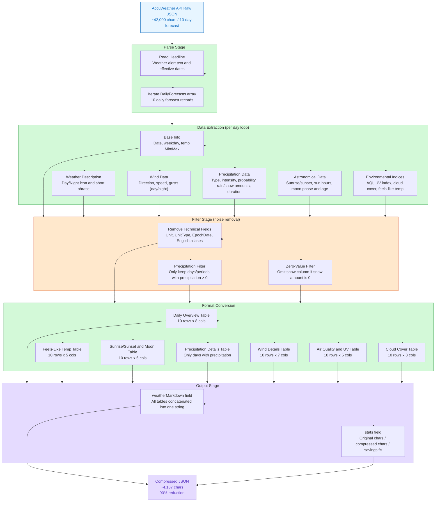

> **Audience**: Company management, product owners, technical decision-makers
> **Key takeaway**: With a single data transformation script, we reduced the weather data sent to AI language models by **90%**, dramatically lowering AI service costs without losing any meaningful information.

---

## 1. Background: Why Does Data Size Matter?

Our product integrates the AccuWeather weather API to power AI-driven conversational features. When a user asks "Is this week good for travel?" or "Do I need an umbrella?", the AI must first read the weather data before generating a response.

**AI services are billed by Token (a unit of text).** Simply put, a Token is roughly a word or word fragment — the more the AI reads and writes, the more it costs.

The raw data returned by the AccuWeather API is standard JSON format. A 10-day forecast contains approximately **41,975 characters**. This format is designed for software systems, not AI models, and is full of redundant content that AI doesn't need. For example:

```json
"Wind": {
  "Speed": {
    "Value": 16.7,
    "Unit": "km/h",
    "UnitType": 7
  },
  "Direction": {
    "Degrees": 199,
    "Localized": "SSW",
    "English": "SSW"
  }
}
```

All of this JSON says one thing: **SSW wind at 17 km/h**.

---

## 2. Core Idea: From "Machine Language" to "Human Language"

Our approach is straightforward: **before sending data to the AI, we run a "translation" step — converting machine-formatted JSON into human-readable Markdown tables.**

Large language models are trained to understand and generate natural language. A Markdown table is both compact and perfectly legible to an AI — no nested structures or repeated field names required.

### Three Compression Principles

| Principle | Original JSON | Compressed | Why It Saves Space |
|-----------|--------------|------------|--------------------|
| **Inline units** | `{"Value": 16.7, "Unit": "km/h", "UnitType": 7}` | `17km/h` | Unit merged into value; type ID removed |
| **Strip redundant fields** | `"EpochDate"`, `"UnitType"`, `"English"` | All removed | AI doesn't need timestamps, type IDs, or duplicate language fields |
| **Conditional rows** | All precipitation fields listed every day (including 0 values) | Only days with actual precipitation shown | Zero values carry no information |

---

## 3. Compression Pipeline

The following flowchart shows the complete process from raw JSON to compressed Markdown:



---

## 4. Results: The Numbers

### 4.1 Data Size Comparison

| Metric | Raw JSON | Compressed Markdown | Change |
|--------|----------|---------------------|--------|
| Character count | 41,975 | 4,187 | **-90%** |
| Estimated tokens | ~10,500 | ~1,050 | **~9,450 tokens saved** |
| Days of forecast | 10 days | 10 days | No information lost |

> Token estimates: ~1.5 chars/token for Chinese, ~4 chars/token for English

### 4.2 Cost Comparison Using GPT-4o as a Reference

| Scenario | Tokens per query | Est. cost at 1,000 queries/day |
|----------|-----------------|-------------------------------|
| Raw JSON | ~10,500 tokens | ~$21 |
| Compressed data | ~1,050 tokens | ~$2.10 |
| **Savings** | **9,450 tokens** | **~$18.90 / day** |

> Actual costs vary by LLM platform and model, but the compression ratio remains consistent.

### 4.3 Information Completeness Verification

The compressed output retains **all** of the following weather information — **nothing is lost**:

- 10-day high/low temperatures, day and night weather descriptions
- Full precipitation data (type, intensity, probability, amounts, duration)
- Wind direction, speed, and gusts
- Sunrise/sunset times, sun hours, moon phase
- AQI air quality, UV index, cloud cover
- Feels-like temperature (direct sun and shade)
- Weather alert headlines

---

## 5. Technical Implementation

The compression script runs as a **JavaScript code node inside the n8n workflow platform**, inserted between the "API call" step and the "send to AI" step. The entire process is automatic and invisible to the end user.

```
[User question] → [n8n Workflow] → [Call AccuWeather API]
                                             ↓
                               [Compression: JSON → Markdown]
                                             ↓
                                    [Send to AI model]
                                             ↓
                                  [AI generates answer] → [Return to user]
```

The core logic has three steps:

1. **Extract meaningful fields**: Keep only what the AI needs to understand the weather; discard system metadata (`EpochDate`, `UnitType`, etc.)
2. **Inline units**: Transform `{"Value": 17, "Unit": "km/h"}` directly into `17km/h`
3. **Tabular output**: Write each day's data as a Markdown table row — field names appear once in the header, not repeated for every row

---

## 6. Future Directions

This solution already delivers significant savings, but it can be extended to become a key part of the company's AI infrastructure.

### 6.1 Integrate into the Company MCP Service to Enforce Standardized Output

**MCP (Model Context Protocol)** is the standard tool-calling protocol introduced by Anthropic — essentially a universal interface between AI models and external services.

We can encapsulate the compression logic inside the company's MCP server. The benefits:

- **Enforced standards**: No matter which AI client calls the weather tool, it always receives compressed Markdown — never raw JSON
- **Centralized maintenance**: The compression logic lives in one place; all connected AI services benefit automatically from any updates
- **Data consistency**: Different AI assistants (Claude, GPT, internal models) all receive weather context in exactly the same format

```
Customer Service Bot ─┐
Internal AI Assistant ─┤──→ [Company MCP Server] ──→ [AccuWeather API]
Mobile AI             ─┘           ↑                         ↓
                           Compression runs here          Raw JSON
                           once, for everyone                 ↓
                                                     Compressed Markdown
```

### 6.2 Expand into Reusable "Data Compression Skills"

Our current solution is tailored for weather forecast data. The same idea can be applied to **any API data** the company uses:

| Data Source | Problem with Raw Format | Compression Approach |
|-------------|------------------------|----------------------|
| CRM customer data | Deep nesting, redundant fields | Extract key fields, flatten to table |
| Order / logistics API | Repeated status codes, timestamp formats | Keep status text and key timestamps only |
| Financial report data | Numeric values stored separately from units | Inline units, skip zero-value rows |
| Product inventory API | Multi-language fields, nested categories | Flatten to single-level description |

Packaging these compression patterns as reusable **n8n workflow nodes (Skills)** lets any team pick them up and use them like building blocks — no need to rebuild the logic from scratch.

### 6.3 Intelligent Dynamic Compression

Taking it one step further, we can make the compression context-aware — **passing only the data relevant to the user's actual question**:

- User asks "Will it rain tomorrow?" → Send only tomorrow's precipitation data (potentially another 90%+ reduction)
- User asks "Which day this week is best for hanging laundry?" → Send only 7-day precipitation probability and cloud cover
- User asks "How warm will it be this weekend?" → Send only Saturday and Sunday temperatures and feels-like data

This "on-demand trimming" approach could theoretically keep single-query Token consumption **under 200 tokens**, compared to 10,500 tokens for the raw JSON — a reduction of over **98%**.

---

## 7. Summary

| Dimension | Result |
|-----------|--------|
| Data compression rate | **90%** (41,975 → 4,187 characters) |
| Information retention rate | **100%** (no weather data lost) |
| Implementation complexity | Low (single JavaScript function, ~200 lines of code) |
| Integration method | n8n workflow node; no changes to existing systems |
| Scalability | High (pattern replicable to any API data compression scenario) |

This solution achieves meaningful cost savings through one simple principle: **AI needs to understand data, not store it. Give the AI a format it can read, not a format designed for machines.**

---

*Document date: March 11, 2026*
*Data source: AccuWeather 10-Day Forecast API (State College, PA)*
*Compression tool: n8n JavaScript Code Node*
