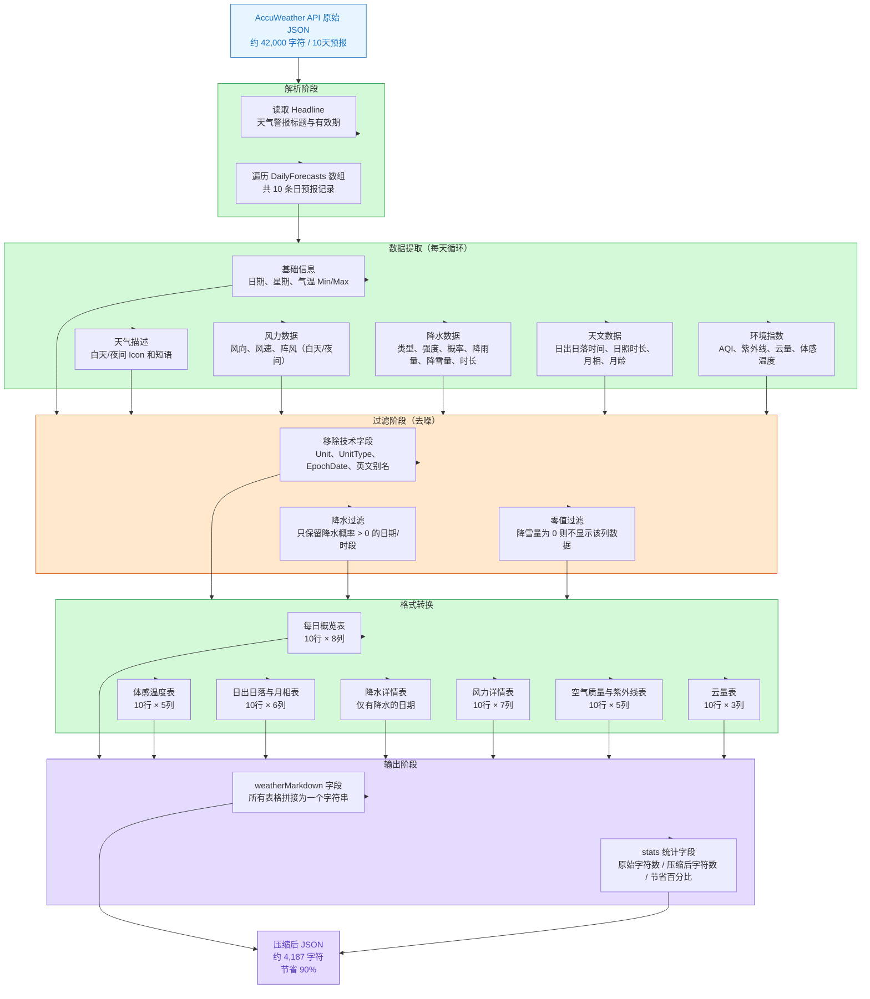

> **适读人群**：公司管理层、产品负责人、技术决策者
> **核心结论**：通过一段数据转换程序，我们将发送给 AI 大语言模型的天气数据量减少了 **90%**，在不损失任何有效信息的前提下，大幅降低了 AI 服务的调用成本。

---

## 一、问题背景：为什么数据量很重要？

我们的产品接入了 AccuWeather 天气 API，用来为用户提供基于天气的智能对话服务。当用户问 AI "本周适合出行吗？" 或 "需要带雨伞吗？"，AI 需要先读取天气数据，再给出回答。

**AI 的计费方式是按 Token（词元）计算的。** 简单理解，Token 就是 AI "读" 和 "写" 的文字数量——读的越多，花费越高。

AccuWeather API 返回的原始数据是标准 JSON 格式，10 天预报数据大约包含 **41,975 个字符**。这些数据格式是为机器程序设计的，包含大量对 AI 来说完全冗余的内容，例如：

```json
"Wind": {
  "Speed": {
    "Value": 16.7,
    "Unit": "km/h",
    "UnitType": 7
  },
  "Direction": {
    "Degrees": 199,
    "Localized": "西南偏南",
    "English": "SSW"
  }
}
```

这段 JSON 描述的信息，其实用一句话就够了：**西南偏南风 17km/h**。

---

## 二、核心思路：从"机器语言"到"人类语言"

我们的方案很直接：**在数据送入 AI 之前，先做一次"翻译"——把机器格式的 JSON 转化为人类易读的 Markdown 表格。**

AI 大语言模型本质上是在理解和生成自然语言，Markdown 表格对它来说既简洁又易懂，完全不需要嵌套结构和重复的字段名。

### 三大压缩原则

| 原则 | 原始 JSON 写法 | 压缩后写法 | 节省原因 |
|------|---------------|-----------|---------|
| **合并单位** | `{"Value": 16.7, "Unit": "km/h", "UnitType": 7}` | `17km/h` | 单位合并到数值，去掉类型编号 |
| **去除冗余** | `"EpochDate"`, `"UnitType"`, `"English"` | 全部删除 | AI 不需要时间戳、类型ID、英文别名 |
| **条件显示** | 每天都列出所有降水字段（含 0 值） | 只显示实际有降水的日期和字段 | 0 值不提供信息，省去无意义行 |

---

## 三、压缩流程详解

以下流程图展示了数据从原始 JSON 到压缩 Markdown 的完整处理过程：




---

## 四、效果对比：数字说话

### 4.1 数据量对比

| 指标 | 原始 JSON | 压缩后 Markdown | 变化 |
|------|-----------|----------------|------|
| 字符数 | 41,975 | 4,187 | **-90%** |
| 预估 Token 数 | ~10,500 | ~1,050 | **节省约 9,450 tokens** |
| 包含天数 | 10 天 | 10 天 | 信息完整 |

> Token 数按中文约 1.5 字符/token、英文约 4 字符/token 估算

### 4.2 以 GPT-4o 为例的费用对比

| 场景 | 每次查询 Token | 每天 1000 次查询费用（估算） |
|------|---------------|---------------------------|
| 使用原始 JSON | ~10,500 tokens | 约 ¥150 |
| 使用压缩数据 | ~1,050 tokens | 约 ¥15 |
| **节省** | **9,450 tokens** | **约 ¥135 / 天** |

> 实际费用因所用 LLM 平台和模型而异，但压缩比例保持稳定。

### 4.3 信息完整性验证

压缩后的数据包含了以下所有关键信息，**没有任何气象信息丢失**：

- 10 天每日高低温、白天/夜间天气描述
- 完整的降水信息（类型、强度、概率、降水量、时长）
- 风向风速及阵风数据
- 日出日落、日照时长、月相
- AQI 空气质量、紫外线指数、云量
- 体感温度（直射和阴凉处）
- 天气警报提示

---

## 五、技术实现概述

压缩程序在 **n8n 工作流平台** 中以 JavaScript 代码节点运行，插入在 "API 调用" 和 "发送给 AI" 之间，整个过程自动完成，用户无感知。

```
[用户提问] → [n8n 工作流] → [调用 AccuWeather API]
                                      ↓
                          [压缩程序：JSON → Markdown]
                                      ↓
                              [发送给 AI 模型]
                                      ↓
                              [AI 生成回答] → [返回用户]
```

程序的核心逻辑分三步：

1. **提取有价值的字段**：只保留 AI 理解天气所需的字段，过滤掉系统元数据（如 `EpochDate`、`UnitType`）
2. **单位内联**：将 `{"Value": 17, "Unit": "km/h"}` 直接合并为 `17km/h`
3. **表格化输出**：将每天的数据写成 Markdown 表格行，字段名只出现一次（表头），而非每行都重复

---

## 六、未来展望

这套方案目前已经取得了显著效果，但我们可以进一步扩展，使其成为公司 AI 基础设施的重要组成部分。

### 6.1 集成到公司 MCP 服务，统一规范输出格式

**MCP（Model Context Protocol）** 是 Anthropic 推出的 AI 工具调用标准协议，类似于 AI 与外部服务之间的"通用接口"。

我们可以将天气数据压缩逻辑封装进公司的 MCP 服务器中，这样做的好处是：

- **强制规范**：无论哪个 AI 客户端调用天气工具，返回的都是压缩好的 Markdown 格式，而不是原始 JSON
- **集中维护**：压缩逻辑只需在一处更新，所有接入的 AI 服务自动受益
- **数据一致性**：不同 AI 助手（Claude、GPT、内部模型）获得格式完全一致的天气上下文

```
客服 AI Bot ─┐
内部 AI 助手 ─┤──→ [公司 MCP 服务器] ──→ [AccuWeather API]
移动端 AI    ─┘         ↑                        ↓
                   压缩逻辑在此                原始 JSON
                   统一执行                        ↓
                                           压缩后 Markdown
```

### 6.2 扩展为通用的"数据压缩 Skills"

目前我们的方案针对天气预报数据定制。但同样的思路可以推广到公司使用的**所有 API 数据**：

| 数据来源 | 原始格式问题 | 可压缩方向 |
|---------|-------------|-----------|
| CRM 客户数据 | 嵌套层级深，字段冗余 | 提取关键字段，表格化 |
| 订单/物流 API | 重复状态码、时间戳格式 | 只保留状态文字和关键时间 |
| 财务报表数据 | 大量数值与单位分离存储 | 合并单位，忽略零值行 |
| 产品库存 API | 多语言字段、分类层级 | 扁平化为一级描述 |

将这些压缩逻辑封装为可复用的 **n8n 工作流节点（Skills）**，各业务线可以像使用"积木"一样直接调用，而不需要每次重新开发。

### 6.3 智能动态压缩

更进一步，我们可以让压缩程序"聪明"起来——**根据用户的实际问题，只传递相关数据**：

- 用户问 "明天下雨吗？" → 只传明天的降水数据（进一步节省 90% 以上）
- 用户问 "本周适合晾衣服哪天？" → 只传未来 7 天的降水概率和云量
- 用户问 "周末气温如何？" → 只传周六周日的气温和体感温度

这种"按需裁剪"的方式，理论上可以将单次查询的 Token 消耗控制在 **200 个以内**，相比原始 JSON 的 10,500 个 Token，节省超过 **98%**。

---

## 七、总结

| 维度 | 效果 |
|------|------|
| 数据压缩率 | **90%**（41,975 → 4,187 字符） |
| 信息保留率 | **100%**（无气象信息丢失） |
| 实现复杂度 | 低（单个 JavaScript 函数，约 200 行代码） |
| 接入方式 | n8n 工作流节点，无需改动现有系统 |
| 可扩展性 | 高（可复制到其他 API 数据压缩场景） |

这套方案用一个简单的原则实现了显著的成本优化：**AI 需要理解数据，而不是存储数据。给 AI 读得懂的格式，而不是机器解析的格式。**

---

*文档生成日期：2026-03-11*
*数据来源：AccuWeather 10日预报 API（State College, PA）*
*压缩工具：n8n JavaScript Code Node*

![[Pasted image 20260311143101.png]]